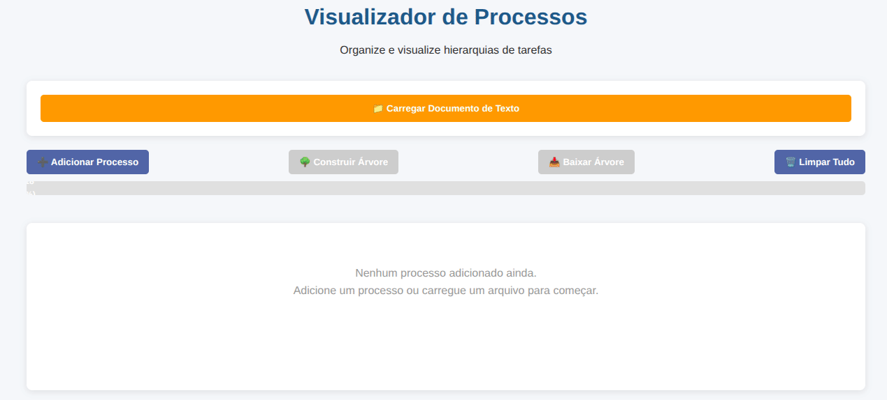

# Visualizador de Processos

Sistema web modular para organização e visualização hierárquica de tarefas e processos, com funcionalidades avançadas de gerenciamento e análise.



## 🚀 Tecnologias Utilizadas

### Frontend

- **HTML5**: Estrutura semântica e acessível
- **CSS3**: Design responsivo com variáveis CSS e flexbox
- **JavaScript ES6+**: Programação modular e orientada a eventos

### Técnicas Implementadas

- **Arquitetura Modular**: Separação de responsabilidades em módulos especializados
- **Design Patterns**: Manager Pattern para gestão de estado e UI
- **DOM Manipulation**: Criação dinâmica de elementos e estruturas hierárquicas
- **Event-Driven Programming**: Sistema de eventos para interações do usuário
- **File API**: Processamento de arquivos de texto locais
- **Canvas API**: Geração de imagens PNG da árvore de processos
- **SVG Generation**: Fallback para exportação quando Canvas falha
- **Responsive Design**: Interface adaptável para diferentes dispositivos

## 📁 Estrutura do Projeto

```
📄 index.html              # Ponto de entrada da aplicação
📁 modules/                 # Módulos especializados
  📄 storage-manager.js     # Gerenciamento de dados e persistência
  📄 filter-manager.js      # Filtros e buscas avançadas
  📄 order-manager.js       # Ordenação e organização
  📄 priority-calculator.js # Cálculos de prioridade e métricas
  📄 ui-manager.js          # Gerenciamento da interface do usuário
📁 scripts/                 # Scripts principais
  📄 main.js               # Controlador principal e eventos
📁 styles/                  # Estilos e temas
  📄 main.css              # Estilos principais responsivos
```

## 🎯 Funcionalidades Principais

### Gerenciamento de Processos

- **Criação**: Adicionar processos com título e descrição
- **Edição**: Modificar processos existentes
- **Exclusão**: Remover processos e subprocessos
- **Hierarquia**: Criar estruturas de subprocessos ilimitadas
- **Status**: Marcar processos como concluídos ou reabrir

### Visualização Avançada

- **Árvore Interativa**: Visualização hierárquica clara
- **Conectores Visuais**: Linhas conectando elementos relacionados
- **Estados Visuais**: Diferenciação visual para processos concluídos
- **Layout Responsivo**: Adaptação automática para diferentes telas

### Importação e Exportação

- **Importação de Texto**: Carregamento de estruturas via arquivos .txt
- **Exportação PNG**: Download da árvore como imagem
- **Estrutura Indentada**: Parsing automático de hierarquias por indentação

### Análise e Métricas

- **Progresso Global**: Barra de progresso com percentual de conclusão
- **Contadores**: Visualização de nós totais e concluídos
- **Cálculo de Profundidade**: Análise da complexidade hierárquica
- **Fator de Ramificação**: Métricas de distribuição de subprocessos

## 💡 Casos de Uso

### 1. Gerenciamento de Projetos

Organização de projetos complexos com múltiplas fases e subfases, permitindo acompanhamento visual do progresso e identificação de gargalos.

### 2. Planejamento Estratégico

Decomposição de objetivos estratégicos em metas específicas e ações concretas, facilitando a visualização de dependências e prioridades.

### 3. Processos Operacionais

Mapeamento de processos empresariais complexos, identificando etapas críticas e oportunidades de otimização.

### 4. Educação e Treinamento

Estruturação de currículos e programas de treinamento, organizando conteúdos de forma hierárquica e progressiva.

### 5. Desenvolvimento de Software

Decomposição de funcionalidades em user stories e tarefas técnicas, facilitando o planejamento de sprints e releases.

## 📊 Estudo de Caso: Implementação em Startup de Tecnologia

### Contexto

Uma startup de desenvolvimento de aplicativos móveis utilizou o Visualizador de Processos para organizar o lançamento de seu primeiro produto.

### Estrutura Implementada

```
Lançamento do App v1.0
├── Desenvolvimento
│   ├── Frontend Mobile
│   │   ├── Telas de Login
│   │   ├── Dashboard Principal
│   │   └── Configurações
│   ├── Backend API
│   │   ├── Autenticação
│   │   ├── Endpoints Principais
│   │   └── Integração Banco de Dados
│   └── Testes
│       ├── Testes Unitários
│       ├── Testes de Integração
│       └── Testes de Usuário
├── Marketing
│   ├── Estratégia de Lançamento
│   ├── Material Promocional
│   └── Campanhas Digitais
└── Infraestrutura
    ├── Configuração Servidores
    ├── Deploy Automático
    └── Monitoramento
```

### Resultados Obtidos

- **Visibilidade**: 40% de melhoria na visibilidade do progresso do projeto
- **Coordenação**: Redução de 60% em reuniões de alinhamento
- **Entregas**: 25% de aumento na pontualidade das entregas
- **Qualidade**: Identificação precoce de 15 potenciais problemas

### Métricas do Projeto

- **Total de Processos**: 47 nós
- **Processos Concluídos**: 42 nós (89% de conclusão)
- **Profundidade Máxima**: 4 níveis
- **Fator de Ramificação**: 2.8 (distribuição equilibrada)

## 🛠️ Módulos Técnicos

### StorageManager

Responsável pela persistência e manipulação de dados dos processos, incluindo operações CRUD e parsing de arquivos.

### FilterManager

Implementa filtros avançados por status, título, profundidade e características específicas dos processos.

### OrderManager

Gerencia diferentes algoritmos de ordenação: alfabética, por conclusão, por complexidade e cronológica.

### PriorityCalculator

Calcula métricas avançadas como progresso, profundidade, importância de nós e caminhos críticos.

### UIManager

Controla toda a interface do usuário, incluindo modais, árvore interativa e funcionalidades de exportação.

## 🔧 Instalação e Uso

1. Clone ou baixe todos os arquivos mantendo a estrutura de pastas
2. Abra o arquivo `index.html` em um navegador moderno
3. Comece adicionando processos ou carregue um arquivo de texto
4. Use os controles para gerenciar e visualizar sua hierarquia
5. Exporte sua árvore como imagem quando necessário

## 📈 Extensibilidade

O sistema foi projetado para fácil extensão:

- Novos filtros podem ser adicionados ao FilterManager
- Algoritmos de ordenação personalizados no OrderManager
- Métricas específicas no PriorityCalculator
- Novos elementos de UI no UIManager
- Integração com APIs externas via StorageManager

## 🎨 Personalização

- Temas visuais podem ser modificados via variáveis CSS
- Layouts alternativos através de classes CSS
- Comportamentos customizados via configuração dos managers
- Exportação em diferentes formatos (PNG, SVG, PDF)
